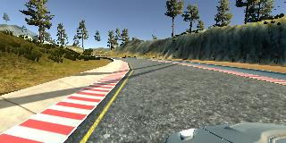

# **Behavioral Cloning** 

## Ahsan Habib

---

**Behavioral Cloning Project**

The goals / steps of this project are the following:

* Use the simulator to collect data of good driving behavior
* Build, a convolution neural network in Keras that predicts steering angles from images
* Train and validate the model with a training and validation set
* Test that the model successfully drives around track one without leaving the road
* Summarize the results with a written report


[//]: # (Image References)

[image1]: ./examples/placeholder.png "Model Visualization"
[image2]: ./examples/placeholder.png "Grayscaling"
[image3]: ./examples/placeholder_small.png "Recovery Image"
[image4]: ./examples/placeholder_small.png "Recovery Image"
[image5]: ./examples/placeholder_small.png "Recovery Image"
[image6]: ./examples/placeholder_small.png "Normal Image"
[image7]: ./examples/placeholder_small.png "Flipped Image"

## Rubric Points
### Here I will consider the [rubric points](https://review.udacity.com/#!/rubrics/432/view) individually and describe how I addressed each point in my implementation.  

---
### Files Submitted & Code Quality

#### 1. Submission includes all required files and can be used to run the simulator in autonomous mode

My project includes the following files:

* model.py containing the script to create and train the model
* drive.py for driving the car in autonomous mode
* model.h5 (or model-best.h5) containing a trained convolution neural network 
* writeup: "behavior cloning writeup ahsan habib.md" or "behavior cloning writeup ahsan habib.md.pdf" summarizing the results
* mp4 video. I have created a video of autonomous driving of the car using video.py script. However, it does not capture the car itself. Only images that the camera in the car sees. Therefore, I have T1R3Video.mp4 in project space created by video.py file. I have also recorded the session in my mobile phone and I have provided a youtube link (https://youtu.be/oc5HgB_gYeo) of the video in this writeup.

I have provided multiple saved model files. Using model-best.h5, I was able to create this model that drives the car full track one within lane boundary. It uses 0.15 steering wheel correction for left and right images. Validation set is 20% of training set. Another model file in the project space that drives the car within the road but it crosses yellow line time to time (model-cross-yellow-on-road.h5)

#### 2. Submission includes functional code
Using the Udacity provided simulator and my drive.py file, the car can be driven autonomously around the track by executing 

```sh
python drive.py model-best.h5
```

#### 3. Submission code is usable and readable

The model.py file contains the code for training and saving the convolution neural network. The file shows the pipeline I used for training and validating the model, and it contains comments to explain how the code works.


### Model Architecture and Training Strategy

#### 1. An appropriate model architecture has been employed

My model consists of a convolution neural network with 5x5 size filter for 3 layers and 3x3 size filter for additional 2 layers. (code function def create_model in model.py file)

The model includes RELU layers to introduce nonlinearity, and the data is normalized in the model using a Keras lambda layer. I cropped the images 50 pixel top and 10 pixel bottom to get rid of sky and car dashboard. They do not contribute to learning and add noises in training the car to stay on the road. 

#### 2. Attempts to reduce overfitting in the model

The model contains dropout layers in order to reduce overfitting. The model was trained and validated on different data sets to ensure that the model was not overfitting. The model was tested by running it through the simulator and ensuring that the vehicle could stay on the track.

#### 3. Model parameter tuning

The model used an adam optimizer, so the learning rate was not tuned manually. 

#### 4. Appropriate training data

Training data was chosen to keep the vehicle driving on the road. I used a combination of center lane driving, recovering from the left and right sides of the road.

For details about how I created the training data, see the next section. 

### Model Architecture and Training Strategy

#### 1. Solution Design Approach

I mostly follow NVIDIA paper to create the CNN architecture. I modified the parameters to as needed to train with the images collected from the simulator. The following figure shows NVIDIA architecture and corresponding description of layers, activation, and maxpooling paramters.


NVIDIA paper uses deep learning to train a model and then drive the car autonomously. Therefore, I think it's a good starting point for me to start with that.

In order to gauge how well the model was working, I split my image and steering angle data into a training and validation set. I found that my first model had a low mean squared error on the training set but a high mean squared error on the validation set. This implied that the model was overfitting. To combat the overfitting, I have cropped the images to get rid of sky and dashboard and added dropout layers. 

The final step was to run the simulator to see how well the car was driving around track one. There were a few spots where the vehicle fell off the track. To improve the driving behavior in these cases, I have augmented the data with flipped images. For the left and right images, I flipped and I have corrected the steering wheel angel as follows:

```
steering_left = steering_center + correction
steering_right = steering_center - correction

I have tuned correction factor to 0.15 and 0.20.

```

NVIDIA paper preprocess the images by converting them from RGB to YUV. I have followed that.

Even that the car was not driving well on track. Then, I got some tips from the project page that has a reference of cheat sheet (tips) by Paul Heraty. He recommended not to use keyboard to collect training data. Instead, use a game controller.  Unfortunately, the recent simulator (beta version) does not support game controller (turn does not work). So, I used the simulator from 2016, to collect training data using a Xbox controller. That made a big difference. I was able to create a model to run autonomously using this training data. 

At the end of the process, the vehicle is able to drive autonomously around the track without leaving the road.


#### 2. Final Model Architecture

The final model architecture consisted of a convolution neural network with the following layers and layer sizes. Here is a  summary of the model


#### 3. Creation of the Training Set & Training Process

To capture good driving behavior, I first recorded two laps on track one using center lane driving. Here is an example image of center lane driving:

<p float="left">
  
  
  

</p>

Figure: A snapshot of images from left, center and right camera during data collection

I then recorded the vehicle recovering from the left side and right sides of the road back to center so that the vehicle would learn to adjust steering wheel and move away from left and right too much.

<p float="left">
  
  
  
</p>

Figure: Another snapshot of images from left, center and right camera during data collection

To augment the data sat, I also flipped images and reverse angles thinking that this would help to create more data set and handle the opposite situation. For example, here is an image that has then been flipped:


Figure: Augment image set with flipped the image and reverse the steering wheel.


Figure: Augment image set with flipped the image and reverse the steering wheel

I have also collected data by driving the track in the opposite direction and also going out of track and then reversing the gear to get back to the track again.

After the collection process, I had X number of data points. I then preprocessed this data by converting RGB to YUV (similar to NVIDIA paper)

I finally randomly shuffled the data set and put 20% of the data into a validation set. 

I used this training data for training the model. The validation set helped determine if the model was over or under fitting. The ideal number of epochs was 4 as evidenced by validation loss decrease. I used an adam optimizer so that manually training the learning rate wasn't necessary.

```
6475/6475 [==============================] - 27s - loss: 0.0247 - val_loss: 0.0235
Epoch 2/4
6475/6475 [==============================] - 21s - loss: 0.0213 - val_loss: 0.0219
Epoch 3/4
6475/6475 [==============================] - 21s - loss: 0.0205 - val_loss: 0.0205
Epoch 4/4
6475/6475 [==============================] - 21s - loss: 0.0202 - val_loss: 0.0197

```

[](https://youtu.be/oc5HgB_gYeo "Autonomous driving")

I haven't spent any time to upgrade drive.py file so that the car can adjust automatically. For the model-best.h5 model, the car drives well at speed 9-15 mph. If I bump it up to 20 or 30 mph, I see it goes out of road around some sharp curves in the track.

###4 Track two

I spent a lot of time to see if we can do something on track two. As, the new simulator does not support game controller, I collected training data for track 2 using keyboard and do not get good results out of it. Old simulator has different track 2 (single lane, instead of two lanes)

